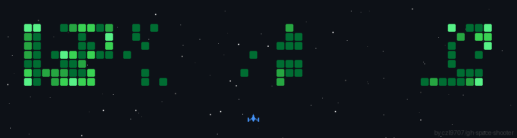

<div align="center">

Hi My name is Morten Barthel
======================================================================================================================================

</div>

------------------
<!--Colored Waving Animation-->
<div align="center">
  
</div>

<!--Some Information about Me-->
```assembly
section .data
    name db "Morten Barthel", 0
    age db "14", 0
    country db "Germany", 0
    language db "German, English, French", 0
    email db "netroMorten@web.de", 0
    collaboration db "Rust projects", 0
    hobbies db "Programming, Math, Dancing", 0
    editor db "Neovim", 0
    os db "Arch Linux", 0
```

<!--My GitHub Stats and most used Languages-->
<div align="center">

<table>
  <tr>
      <td></td>
      <td></td>
  </tr>
</table>

<!--My Skills and Count of Visits-->
<table>
  <tr>
    <td align="center">

### My Skills

<a href="https://www.rust-lang.org/" target="_blank" rel="noreferrer"></a>
<a href="https://docs.microsoft.com/en-us/cpp/?view=msvc-170" target="_blank" rel="noreferrer"></a>
<a href="https://www.typescriptlang.org/" target="_blank" rel="noreferrer"></a>
<a href="https://www.python.org/" target="_blank" rel="noreferrer"></a>
<a href="https://www.gnu.org/software/bash/" target="_blank" rel="noreferrer"></a>
<a href="https://neovim.io/" target="_blank" rel="noreferrer"></a>
<a href="https://www.linux.org" target="_blank" rel="noreferrer"></a>

</td>
<td align="center">

### Profile Views


</td>
  </tr>
</table>

</div>

<!--My GitHub Trophies-->
<div align="center">
    
### My GitHub Trohies


</div>

<!--My Contributing Graph-->
<div align="center">
    
### My Contribution Graph


</div>

<!-- Contribution Space Shooting -->


<!--My GitHub Streak-->
<!--
[](https://git.io/streak-stats)
-->
